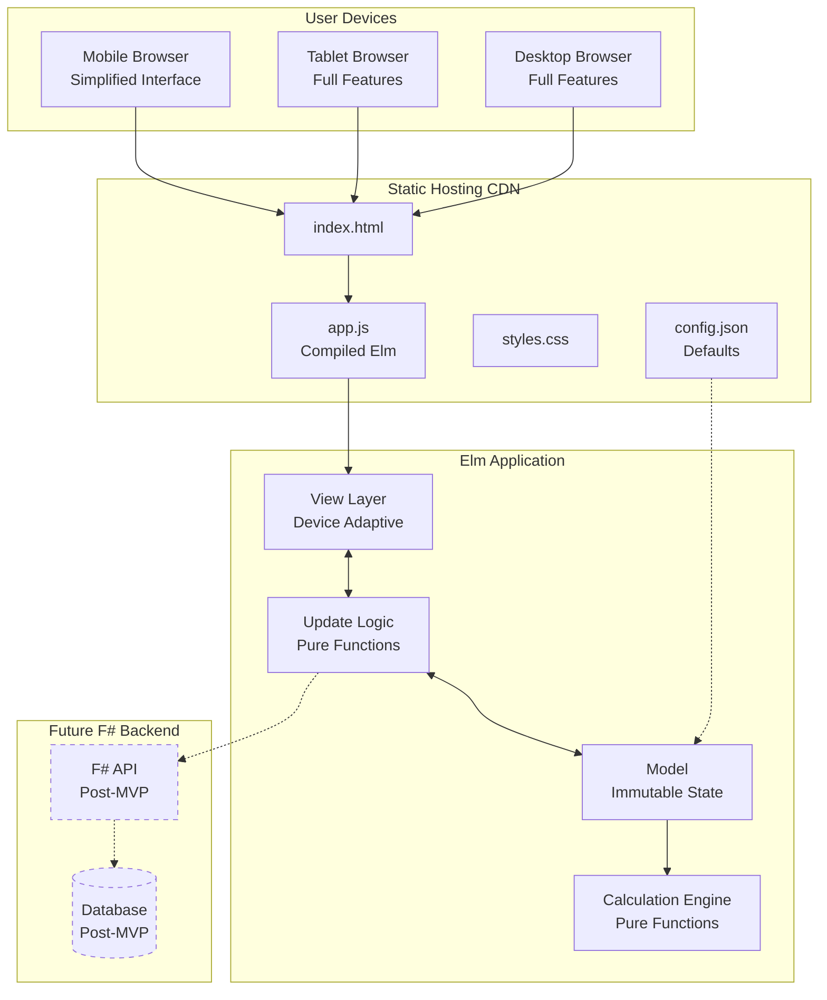
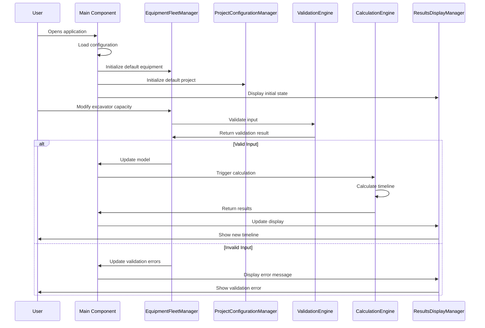
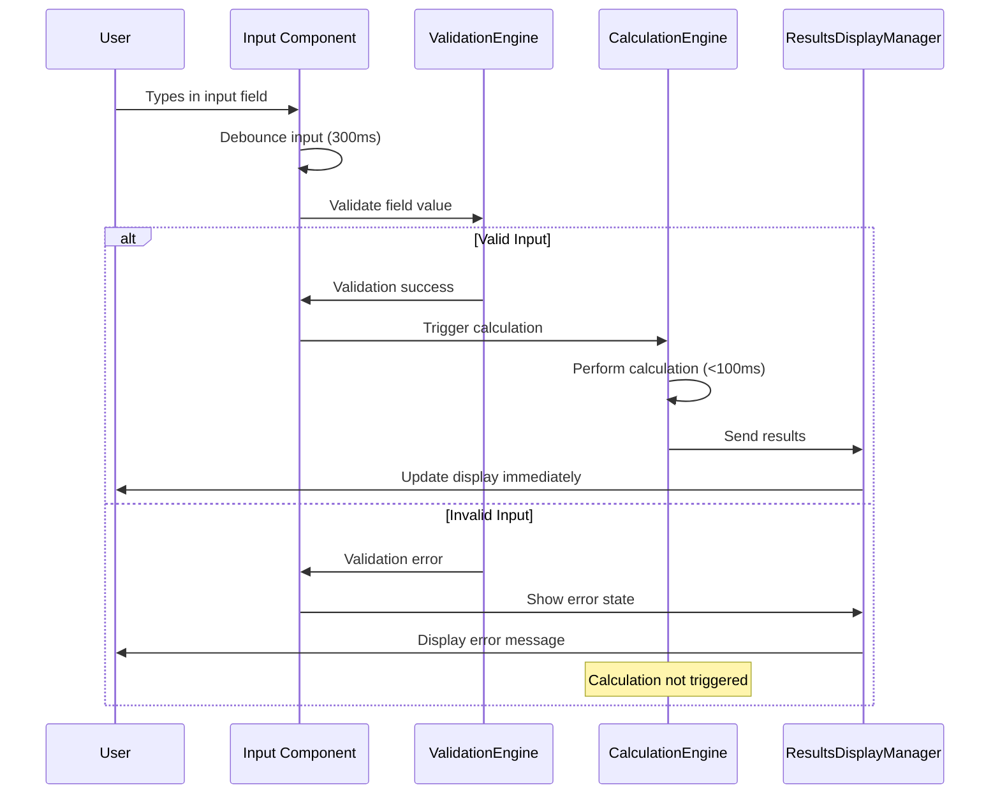
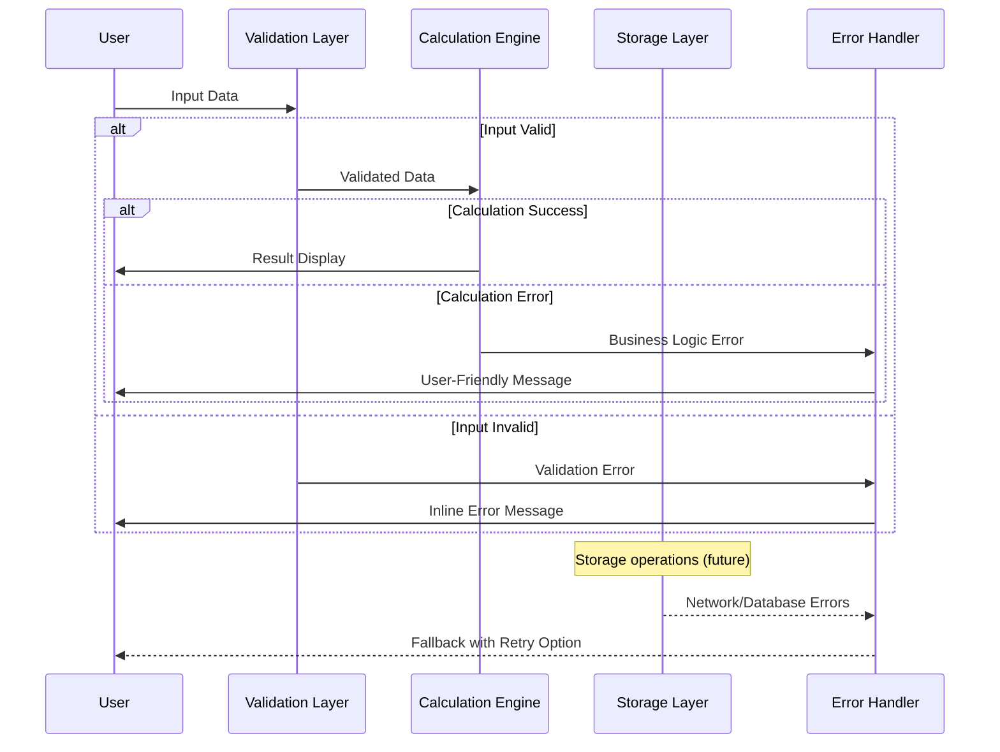

# Pond Digging Calculator Fullstack Architecture Document

## Introduction

This document outlines the complete fullstack architecture for Pond Digging Calculator, including backend systems, frontend implementation, and their integration. It serves as the single source of truth for AI-driven development, ensuring consistency across the entire technology stack.

This unified approach combines what would traditionally be separate backend and frontend architecture documents, streamlining the development process for modern fullstack applications where these concerns are increasingly intertwined.

### Starter Template or Existing Project
N/A - Greenfield project

### Change Log
| Date | Version | Description | Author |
|------|---------|-------------|---------|
| 2025-08-05 | 1.0 | Initial architecture document creation | Winston (Architect) |

## High Level Architecture

### Technical Summary
The Pond Digging Calculator is a **pure client-side web application** built with **Elm 0.19+** that provides instant pond excavation timeline calculations through a functional programming architecture. The application deploys as static files to **GitHub Pages or Netlify**, eliminating server infrastructure costs while delivering sub-second calculation updates. The system features a responsive design that adapts complexity by device - comprehensive mixed-fleet capabilities on desktop/tablet interfaces and simplified calculator functionality on mobile. All calculations execute through pure functions with immutable data structures, ensuring zero runtime exceptions critical for professional construction tool credibility. This architecture achieves the PRD goals of instant calculations, professional reliability, and accessibility across all device types while maintaining a clear migration path to add an F# backend for future data persistence needs.

### Platform and Infrastructure Choice

**Platform:** Static Hosting (GitHub Pages or Netlify)
**Key Services:** 
- GitHub Pages for hosting (free tier)
- JSON configuration files for defaults
- Client-side Elm application
- No backend services in MVP
**Deployment Host and Regions:** 
- Primary: GitHub Pages (global CDN)
- Alternative: Netlify (global edge network)
- Region: Global distribution via CDN

### Repository Structure

**Structure:** Monorepo
**Monorepo Tool:** N/A - Simple structure, npm/yarn workspaces if needed
**Package Organization:** 
- Single Elm application package
- Shared configuration in JSON files
- Build scripts in root directory
- Future: packages/ folder when F# backend added

### High Level Architecture Diagram



### Architectural Patterns

- **Elm Architecture (TEA):** Model-View-Update pattern with unidirectional data flow for predictable state management - _Rationale:_ Ensures type safety and eliminates runtime exceptions critical for professional tools
- **Functional Core, Imperative Shell:** Pure calculation functions wrapped by minimal imperative UI layer - _Rationale:_ Maximizes testability and reliability of core business logic
- **Static Site Generation:** Pre-built assets served from CDN without server computation - _Rationale:_ Zero infrastructure costs and global availability with excellent performance
- **Progressive Enhancement:** Core functionality works immediately, advanced features load as needed - _Rationale:_ Ensures fast initial load and immediate utility for users
- **Device-Adaptive Complexity:** Different feature sets for mobile vs desktop/tablet - _Rationale:_ Optimizes user experience for different work contexts (field vs office)
- **Build-Time Configuration:** JSON configuration compiled statically into application bundle - _Rationale:_ Eliminates HTTP dependencies, enables offline-first operation, and ensures configuration consistency
- **Immutable Data Structures:** All state changes create new objects rather than mutations - _Rationale:_ Prevents bugs from shared mutable state and enables time-travel debugging

## Tech Stack

| Category | Technology | Version | Purpose | Rationale |
|----------|------------|---------|---------|-----------|
| Frontend Language | Elm | 0.19.1 | Type-safe functional programming | Zero runtime exceptions, enforced immutability critical for reliability |
| Frontend Framework | Elm Architecture | Built-in | Model-View-Update pattern | Predictable state management, time-travel debugging |
| CSS Framework | Tailwind CSS | 3.4+ | Utility-first styling | Predictable utilities, responsive, small bundle with purging |
| CSS Type Safety | elm-css or typed modules | Latest | Type-safe CSS classes | Prevents class name typos and style bugs |
| State Management | Elm Runtime | Built-in | Immutable state management | Single source of truth, no state synchronization issues |
| Backend Language | N/A (F# future) | N/A | No backend in MVP | Pure client-side for zero infrastructure costs |
| Backend Framework | N/A (Giraffe future) | N/A | No backend in MVP | F# functional web framework planned post-MVP |
| API Style | N/A (REST future) | N/A | No API in MVP | RESTful API planned for F# backend |
| Database | N/A (PostgreSQL future) | N/A | No database in MVP | PostgreSQL planned for data persistence post-MVP |
| Cache | Browser LocalStorage | HTML5 | Client-side state cache | Simple persistence without backend |
| File Storage | JSON Config Files | Static | Configuration storage | Equipment defaults and validation rules |
| Authentication | N/A | N/A | No auth in MVP | No user accounts needed initially |
| Frontend Testing | elm-test | 0.19.1 | Unit and integration testing | Built-in test runner for Elm |
| Backend Testing | N/A | N/A | No backend in MVP | F# testing planned post-MVP |
| E2E Testing | Cypress | 13.0+ | End-to-end testing | Cross-browser automated testing |
| Build Tool | Elm Compiler | 0.19.1 | Compilation to JavaScript | Type checking and optimization |
| Bundler | Parcel | 2.0+ | Asset bundling | Zero-config bundling with hot reload |
| IaC Tool | GitHub Actions | N/A | CI/CD automation | Built into GitHub, no additional tools |
| CI/CD | GitHub Actions | Latest | Continuous deployment | Automated testing and deployment to GitHub Pages |
| Monitoring | Browser Console | Built-in | Error logging | Client-side error tracking |
| Logging | elm-log | 0.19.0 | Debug logging | Development-time logging |
| CSS Framework | CSS Grid/Flexbox | CSS3 | Responsive layout | Native browser layout without dependencies |

## Data Models

### Excavator
**Purpose:** Represents an excavator machine with its operational specifications for calculating digging productivity

**Key Attributes:**
- id: EquipmentId - Unique identifier for the excavator instance
- bucketCapacity: Float - Bucket size in cubic yards (typically 0.5-15.0)
- cycleTime: Float - Minutes per dig-dump cycle (typically 0.5-10.0)
- name: String - User-friendly label (e.g., "CAT 320 Excavator")
- isActive: Bool - Whether this excavator is included in calculations

**Elm Type Definition:**
```elm
type EquipmentId = EquipmentId String

type alias Excavator =
    { id : EquipmentId
    , bucketCapacity : Float  -- cubic yards
    , cycleTime : Float       -- minutes
    , name : String
    , isActive : Bool
    }
```

**Relationships:**
- Part of Equipment list in Model
- Used by CalculationEngine module

### Truck
**Purpose:** Represents a dump truck with capacity and travel time specifications for hauling calculations

**Elm Type Definition:**
```elm
type alias Truck =
    { id : EquipmentId
    , capacity : Float        -- cubic yards
    , roundTripTime : Float   -- minutes
    , name : String
    , isActive : Bool
    }
```

### PondDimensions
**Purpose:** Defines the excavation area dimensions and resulting volume to be removed

**Elm Type Definition:**
```elm
type PondShape 
    = Rectangular 
    | Irregular  -- future enhancement

type alias PondDimensions =
    { length : Float          -- feet
    , width : Float           -- feet
    , depth : Float           -- feet
    , volume : Float          -- cubic yards (calculated)
    , shape : PondShape
    }
```

### ProjectConfiguration
**Purpose:** Contains project-specific settings and operational parameters

**Elm Type Definition:**
```elm
type alias ProjectConfiguration =
    { workHoursPerDay : Float
    , projectName : Maybe String
    , location : Maybe String
    , pondDimensions : PondDimensions
    }
```

### CalculationResult
**Purpose:** Contains the timeline calculation output with detailed breakdown and analysis

**Elm Type Definition:**
```elm
type Bottleneck
    = ExcavationLimited
    | HaulingLimited
    | Balanced

type ConfidenceLevel
    = High
    | Medium
    | Low

type alias ValidationWarning =
    { message : String
    , severity : WarningSeverity
    }

type WarningSeverity = Info | Warning | Critical

type alias CalculationResult =
    { timelineInDays : Int      -- whole days
    , totalHours : Float         -- precise calculation
    , excavationRate : Float    -- cy/hour
    , haulingRate : Float       -- cy/hour
    , bottleneck : Bottleneck
    , confidence : ConfidenceLevel
    , assumptions : List String
    , warnings : List ValidationWarning
    }
```

### Application Model
**Purpose:** Root application state containing all data with type-safe validation

**Elm Type Definition:**
```elm
type DeviceType
    = Mobile
    | Tablet
    | Desktop

-- Type-safe validation state
type FieldId
    = ExcavatorField EquipmentId ExcavatorField
    | TruckField EquipmentId TruckField
    | PondField PondField
    | ProjectField ProjectField

type ExcavatorField
    = BucketCapacity
    | CycleTime
    | ExcavatorName

type TruckField
    = TruckCapacity
    | RoundTripTime
    | TruckName

type PondField
    = PondLength
    | PondWidth
    | PondDepth

type ProjectField
    = WorkHours
    | ProjectName
    | Location

type ValidationError
    = ValueTooLow { actual : Float, minimum : Float }
    | ValueTooHigh { actual : Float, maximum : Float }
    | RequiredField
    | InvalidFormat String
    | CustomError String

type alias ValidationState =
    { excavatorErrors : List (EquipmentId, ExcavatorField, ValidationError)
    , truckErrors : List (EquipmentId, TruckField, ValidationError)
    , pondErrors : List (PondField, ValidationError)
    , projectErrors : List (ProjectField, ValidationError)
    }

type alias Model =
    { excavators : List Excavator
    , trucks : List Truck
    , projectConfig : ProjectConfiguration
    , currentResult : Maybe CalculationResult
    , deviceType : DeviceType
    , validationState : ValidationState
    , nextEquipmentId : Int
    }
```

## API Specification

**No REST/GraphQL API in MVP Phase** - The application operates entirely client-side with no server communication for core functionality.

### Configuration API (Static Loading)

**Static Configuration Structure:**
```elm
-- Build-time configuration from Utils.ConfigGenerated.elm
getConfig : Config
getConfig = 
    Utils.ConfigGenerated.staticConfig

-- No HTTP dependencies, embedded in application bundle
type alias ConfigFile =
    { version : String
    , defaults : DefaultValues
    , validation : ValidationRules
    , ui : UiSettings
    }

-- JSON file format (config.json)
{
  "version": "1.0.0",
  "defaults": {
    "excavator": {
      "bucketCapacity": 2.5,
      "cycleTime": 2.0,
      "name": "Standard Excavator"
    },
    "truck": {
      "capacity": 12.0,
      "roundTripTime": 15.0,
      "name": "15-yard Dump Truck"
    },
    "project": {
      "workHoursPerDay": 8.0,
      "pondLength": 50.0,
      "pondWidth": 30.0,
      "pondDepth": 6.0
    }
  },
  "validation": {
    "excavatorCapacity": { "min": 0.5, "max": 15.0 },
    "cycleTime": { "min": 0.5, "max": 10.0 },
    "truckCapacity": { "min": 5.0, "max": 30.0 },
    "roundTripTime": { "min": 5.0, "max": 60.0 },
    "workHours": { "min": 1.0, "max": 16.0 },
    "pondDimensions": { "min": 1.0, "max": 1000.0 }
  }
}
```

### Module APIs (Internal Elm Interfaces)

**CalculationEngine Module API:**
```elm
-- Core calculation function
calculateTimeline : List Excavator -> List Truck -> ProjectConfiguration -> Result CalculationError CalculationResult

-- Equipment productivity calculations
calculateExcavatorRate : List Excavator -> Float
calculateTruckRate : List Truck -> Float

-- Validation functions
validateEquipmentFleet : List Excavator -> List Truck -> Result ValidationError ()
validateProjectConfig : ProjectConfiguration -> Result ValidationError ()
```

## Components

### Main Application Component
**Responsibility:** Root component that manages overall application state, device detection, and coordinates between child components

**Key Interfaces:**
- Initializes application with configuration loading
- Manages device type detection and responsive behavior
- Coordinates state updates between all child components
- Handles top-level error boundaries and fallbacks

**Dependencies:** ConfigurationLoader, DeviceDetector, all child components

**Technology Stack:** Elm main module, Tailwind CSS for base styling, configuration JSON loading

### EquipmentFleetManager
**Responsibility:** Manages the collection of excavators and trucks, handles adding/removing equipment, and maintains fleet state

**Key Interfaces:**
- `addExcavator : Model -> ( Model, Cmd Msg )`
- `removeExcavator : EquipmentId -> Model -> ( Model, Cmd Msg )`
- `updateExcavator : EquipmentId -> ExcavatorUpdate -> Model -> ( Model, Cmd Msg )`
- `addTruck : Model -> ( Model, Cmd Msg )`
- `removeTruck : EquipmentId -> Model -> ( Model, Cmd Msg )`
- `updateTruck : EquipmentId -> TruckUpdate -> Model -> ( Model, Cmd Msg )`

**Dependencies:** ValidationEngine for equipment validation, CalculationEngine for immediate recalculation

**Technology Stack:** Elm update functions, Tailwind CSS for equipment cards, device-responsive behavior

### ProjectConfigurationManager
**Responsibility:** Handles project settings including pond dimensions, work hours, and project metadata

**Key Interfaces:**
- `updatePondDimensions : PondDimensions -> Model -> ( Model, Cmd Msg )`
- `calculatePondVolume : Float -> Float -> Float -> Float`
- `updateWorkHours : Float -> Model -> ( Model, Cmd Msg )`
- `validateProjectConfig : ProjectConfiguration -> Result ValidationError ()`

**Dependencies:** ValidationEngine for input validation, CalculationEngine for volume calculations

**Technology Stack:** Elm forms with Tailwind CSS styling, responsive input layout

### CalculationEngine
**Responsibility:** Core business logic component that performs pond digging timeline calculations using pure functional algorithms

**Key Interfaces:**
- `performCalculation : List Excavator -> List Truck -> ProjectConfiguration -> Result CalculationError CalculationResult`
- `calculateExcavatorProductivity : List Excavator -> Float`
- `calculateTruckProductivity : List Truck -> Float`
- `identifyBottleneck : Float -> Float -> Bottleneck`
- `estimateConfidence : CalculationParameters -> ConfidenceLevel`

**Dependencies:** No external dependencies - pure calculation functions

**Technology Stack:** Pure Elm functions, mathematical calculations, no UI components

### ValidationEngine
**Responsibility:** Handles all input validation, maintains validation state, and provides user-friendly error messages

**Key Interfaces:**
- `validateField : FieldId -> String -> Result ValidationError Float`
- `validateModel : Model -> ValidationState`
- `getFieldError : FieldId -> ValidationState -> Maybe ValidationError`
- `clearValidationErrors : Model -> Model`
- `formatErrorMessage : ValidationError -> String`

**Dependencies:** ValidationRules from configuration, business logic constraints

**Technology Stack:** Elm validation functions, error message formatting, Tailwind CSS for error styling

### DeviceAdaptiveInterface
**Responsibility:** Manages responsive behavior and device-specific feature availability, adapting interface complexity based on screen size

**Key Interfaces:**
- `detectDevice : () -> DeviceType`
- `shouldShowAdvancedFeatures : DeviceType -> Bool`
- `getLayoutClasses : DeviceType -> String`
- `adaptComponentForDevice : DeviceType -> Component -> Component`

**Dependencies:** Browser window size detection, CSS media queries

**Technology Stack:** Elm Browser.Dom for size detection, Tailwind CSS responsive classes, conditional rendering

### ResultsDisplayManager
**Responsibility:** Presents calculation results with appropriate detail level based on device type and user preferences

**Key Interfaces:**
- `displayResults : CalculationResult -> DeviceType -> Html Msg`
- `formatTimeline : Int -> String`
- `showDetailedBreakdown : CalculationResult -> Bool -> Html Msg`
- `generateResultsSummary : CalculationResult -> String`

**Dependencies:** CalculationResult data, device type information

**Technology Stack:** Elm HTML generation, Tailwind CSS for results styling, responsive result cards

## External APIs

**No external API integrations required for MVP phase.** The Pond Digging Calculator operates as a pure client-side application with all functionality contained within the browser environment.

### Future External API Considerations (Post-MVP)

When additional features are needed in future phases, the following external APIs may be integrated:

#### Weather Service API (Future Enhancement)
- **Purpose:** Adjust calculations based on weather conditions affecting productivity
- **Integration Notes:** Would modify calculation multipliers based on precipitation, temperature

#### Equipment Database API (Future Enhancement)
- **Purpose:** Access manufacturer specifications for excavators and dump trucks
- **Integration Notes:** Would populate equipment dropdowns with real manufacturer data

## Core Workflows

### User Calculation Workflow



### Real-time Calculation Update Workflow



## Database Schema

**No database in MVP phase** - All data exists in browser memory and local storage only.

### Current Data Storage (MVP)

**Browser Local Storage Structure:**
```elm
-- Local storage keys and data formats
type StorageKey
    = LastCalculationKey
    | UserPreferencesKey
    | EquipmentPresetsKey

-- Data stored in local storage (JSON serialized)
type alias StoredCalculation =
    { excavators : List Excavator
    , trucks : List Truck
    , projectConfig : ProjectConfiguration
    , result : CalculationResult
    , timestamp : String  -- ISO datetime
    }

-- JSON structure in localStorage
{
  "lastCalculation": {
    "excavators": [...],
    "trucks": [...],
    "projectConfig": {...},
    "result": {...},
    "timestamp": "2025-08-05T10:30:00Z"
  }
}
```

### Future Database Schema (Post-MVP with F# Backend)

When data persistence is added, the following PostgreSQL schema will be implemented:

**Users Table:**
```sql
CREATE TABLE users (
    id UUID PRIMARY KEY DEFAULT gen_random_uuid(),
    email VARCHAR(255) UNIQUE NOT NULL,
    name VARCHAR(255) NOT NULL,
    company VARCHAR(255),
    created_at TIMESTAMP WITH TIME ZONE DEFAULT NOW(),
    updated_at TIMESTAMP WITH TIME ZONE DEFAULT NOW()
);
```

**Projects Table:**
```sql
CREATE TABLE projects (
    id UUID PRIMARY KEY DEFAULT gen_random_uuid(),
    user_id UUID NOT NULL REFERENCES users(id) ON DELETE CASCADE,
    name VARCHAR(255) NOT NULL,
    location VARCHAR(255),
    work_hours_per_day DECIMAL(4,2) NOT NULL DEFAULT 8.00,
    pond_length DECIMAL(8,2) NOT NULL,
    pond_width DECIMAL(8,2) NOT NULL,
    pond_depth DECIMAL(8,2) NOT NULL,
    pond_volume DECIMAL(12,2) NOT NULL, -- calculated field
    created_at TIMESTAMP WITH TIME ZONE DEFAULT NOW(),
    updated_at TIMESTAMP WITH TIME ZONE DEFAULT NOW()
);
```

## Frontend Architecture

### Component Architecture

**Component Organization:**
```
src/
├── Main.elm                    -- Application entry point and main update loop
├── Types/
│   ├── Model.elm              -- Core application state types
│   ├── Equipment.elm          -- Equipment-related types
│   ├── Validation.elm         -- Validation types and errors
│   └── Messages.elm           -- All application messages
├── Components/
│   ├── EquipmentCard.elm      -- Individual equipment item display
│   ├── EquipmentList.elm      -- Equipment fleet management
│   ├── ProjectForm.elm        -- Project configuration inputs
│   ├── ResultsPanel.elm       -- Calculation results display
│   ├── ValidationMessage.elm  -- Error message components
│   └── DeviceDetector.elm     -- Responsive behavior component
├── Pages/
│   ├── Desktop.elm           -- Desktop/tablet full interface
│   ├── Mobile.elm            -- Mobile simplified interface
│   └── Common.elm            -- Shared page elements
├── Utils/
│   ├── Validation.elm        -- Input validation functions
│   ├── Calculations.elm      -- Core calculation engine
│   ├── Formatting.elm        -- Display formatting utilities
│   ├── Storage.elm           -- Local storage operations
│   └── Config.elm            -- Configuration loading
└── Styles/
    ├── Theme.elm             -- Tailwind class definitions
    ├── Components.elm        -- Component-specific styles
    └── Responsive.elm        -- Device-specific styling
```

### State Management Architecture

**State Structure:**
```elm
-- Centralized application state following Elm Architecture
type alias Model =
    { -- Core Data
      excavators : List Excavator
    , trucks : List Truck  
    , projectConfig : ProjectConfiguration
    , appConfig : AppConfiguration
    
    -- UI State
    , deviceType : DeviceType
    , currentPage : Page
    , validationState : ValidationState
    , loadingState : LoadingState
    
    -- Calculation State  
    , currentResult : Maybe CalculationResult
    , calculationInProgress : Bool
    , lastCalculationTime : Time.Posix
    
    -- Session State
    , nextEquipmentId : Int
    , hasUnsavedChanges : Bool
    , sessionStartTime : Time.Posix
    }
```

**State Management Patterns:**
- **Single Source of Truth:** All state lives in one Model
- **Immutable Updates:** State changes create new Model instances
- **Command Pattern:** Side effects handled through Cmd Msg
- **Subscriptions:** Real-time updates through Browser events
- **Local Storage Sync:** Automatic persistence of key data

## Backend Architecture

**No backend in MVP phase** - This section defines the future backend architecture for when data persistence and server-side features are needed.

### Service Architecture (Future F# Implementation)

**Function Organization (Future F# Backend):**
```
src/
├── Domain/
│   ├── Equipment.fs           -- Equipment domain types and logic
│   ├── Project.fs            -- Project domain types and logic
│   ├── Calculation.fs        -- Calculation domain logic
│   └── Validation.fs         -- Domain validation rules
├── Infrastructure/
│   ├── Database/
│   │   ├── ProjectRepository.fs    -- Project data access
│   │   ├── EquipmentRepository.fs  -- Equipment data access
│   │   └── Migrations/            -- Database schema migrations
│   └── Configuration/
│       └── Settings.fs            -- Application configuration
├── Application/
│   ├── ProjectService.fs          -- Project business logic
│   ├── CalculationService.fs      -- Calculation orchestration
│   └── ValidationService.fs       -- Input validation
├── Web/
│   ├── Controllers/
│   │   ├── ProjectController.fs    -- Project API endpoints
│   │   ├── CalculationController.fs -- Calculation API endpoints
│   │   └── ConfigurationController.fs -- Config API endpoints
│   └── Startup.fs                     -- Application startup
└── Tests/
    ├── Domain.Tests/              -- Domain logic tests
    ├── Application.Tests/         -- Service tests
    └── Integration.Tests/         -- API integration tests
```

**Function Template (F# Domain Logic):**
```fsharp
// Domain/Calculation.fs - Pure calculation functions
module Domain.Calculation

// Pure calculation function - mirrors Elm frontend logic
let calculateTimeline (excavators: Excavator list) (trucks: Truck list) (config: ProjectConfiguration) : Result<CalculationResult, CalculationError> =
    result {
        let! validatedExcavators = validateExcavators excavators
        let! validatedTrucks = validateTrucks trucks
        let! validatedConfig = validateProjectConfig config
        
        let excavationRate = calculateExcavationRate validatedExcavators
        let haulingRate = calculateHaulingRate validatedTrucks
        let effectiveRate = min excavationRate haulingRate
        let totalHours = validatedConfig.PondVolume / effectiveRate
        let timelineDays = int (ceil (totalHours / validatedConfig.WorkHoursPerDay))
        
        return {
            TimelineInDays = timelineDays
            TotalHours = totalHours
            ExcavationRate = excavationRate
            HaulingRate = haulingRate
            CalculatedAt = DateTime.UtcNow
        }
    }
```

## Unified Project Structure

```
PondDiggingCalculator/
├── .github/                              # CI/CD workflows
│   └── workflows/
│       ├── elm-ci.yml                   # Elm build and test pipeline
│       ├── deploy-static.yml            # Deploy to GitHub Pages
│       └── fsharp-ci.yml               # Future F# backend CI
├── frontend/                            # Elm application (current MVP)
│   ├── src/
│   │   ├── Main.elm                    # Application entry point
│   │   ├── Types/
│   │   │   ├── Model.elm              # Core application state
│   │   │   ├── Equipment.elm          # Equipment domain types
│   │   │   ├── Validation.elm         # Validation types and errors
│   │   │   └── Messages.elm           # Application messages
│   │   ├── Components/
│   │   │   ├── EquipmentCard.elm      # Equipment display component
│   │   │   ├── EquipmentList.elm      # Fleet management component
│   │   │   ├── ProjectForm.elm        # Project configuration form
│   │   │   ├── ResultsPanel.elm       # Results display component
│   │   │   └── ValidationMessage.elm  # Error message component
│   │   ├── Pages/
│   │   │   ├── Desktop.elm           # Desktop/tablet interface
│   │   │   ├── Mobile.elm            # Mobile interface
│   │   │   └── Common.elm            # Shared page elements
│   │   ├── Utils/
│   │   │   ├── Validation.elm        # Input validation functions
│   │   │   ├── Calculations.elm      # Core calculation engine
│   │   │   ├── Formatting.elm        # Display formatting
│   │   │   ├── Storage.elm           # Local storage operations
│   │   │   └── Config.elm            # Configuration loading
│   │   └── Styles/
│   │       ├── Theme.elm             # Tailwind class definitions
│   │       ├── Components.elm        # Component-specific styles
│   │       └── Responsive.elm        # Device-specific styling
├── config/
│   ├── equipment-defaults.json       # Build-time configuration source
│   └── equipment-defaults.schema.json # Configuration validation schema
│   ├── public/
│   │   ├── index.html                # Main HTML template
│   │   ├── config.json               # DEPRECATED - replaced by build-time config
│   │   ├── favicon.ico               # Site favicon
│   │   └── manifest.json             # PWA manifest (future)
│   ├── tests/
│   │   ├── CalculationTests.elm      # Calculation engine tests
│   │   ├── ValidationTests.elm       # Validation function tests
│   │   └── ComponentTests.elm        # UI component tests
│   ├── elm.json                      # Elm package configuration
│   ├── package.json                  # Node.js build dependencies
│   ├── tailwind.config.js            # Tailwind CSS configuration
│   ├── parcel.json                   # Parcel bundler configuration
│   └── README.md                     # Frontend development guide
├── backend/                          # Future F# backend (post-MVP)
│   ├── src/
│   │   ├── Domain/
│   │   │   ├── Equipment.fs          # Equipment domain logic
│   │   │   ├── Project.fs           # Project domain logic
│   │   │   ├── Calculation.fs       # Calculation domain logic
│   │   │   └── Validation.fs        # Domain validation rules
│   │   ├── Infrastructure/
│   │   │   ├── Database/
│   │   │   │   ├── ProjectRepository.fs    # Project data access
│   │   │   │   ├── EquipmentRepository.fs  # Equipment data access
│   │   │   │   └── Migrations/            # Database migrations
│   │   │   └── Configuration/
│   │   │       └── Settings.fs            # Application settings
│   │   ├── Application/
│   │   │   ├── ProjectService.fs          # Project business logic
│   │   │   ├── CalculationService.fs      # Calculation orchestration
│   │   │   └── ValidationService.fs       # Input validation service
│   │   ├── Web/
│   │   │   ├── Controllers/
│   │   │   │   ├── ProjectController.fs    # Project API endpoints
│   │   │   │   ├── CalculationController.fs # Calculation endpoints
│   │   │   │   └── ConfigController.fs     # Configuration endpoints
│   │   │   └── Startup.fs                 # Application startup
│   │   └── Program.fs                     # Application entry point
│   ├── tests/
│   │   ├── Domain.Tests/              # Domain logic tests
│   │   ├── Application.Tests/         # Application service tests
│   │   └── Integration.Tests/         # API integration tests
│   ├── PondCalculator.Backend.fsproj  # F# project file
│   └── README.md                     # Backend development guide
├── shared/                           # Shared resources and documentation
│   ├── config/
│   │   ├── eslint/                   # Shared ESLint configuration
│   │   └── prettier/                 # Code formatting configuration
│   └── scripts/                      # Shared build and utility scripts
│       ├── build-frontend.sh         # Frontend build script
│       ├── test-all.sh              # Run all tests
│       ├── deploy-static.sh         # Static site deployment
│       └── setup-dev.sh             # Development environment setup
├── docs/                             # Project documentation
│   ├── prd.md                       # Product Requirements Document
│   ├── wireframe-specification.md   # UI wireframes and specs
│   ├── architecture.md              # This architecture document
│   └── development-guide.md         # Development setup guide
├── .env.example                     # Environment variables template
├── .gitignore                       # Git ignore patterns
├── package.json                     # Root package.json for monorepo scripts
├── CLAUDE.md                        # AI development context file
└── README.md                        # Project overview and setup
```

## Development Workflow

### Local Development Setup

**Prerequisites:**
```bash
# Required tools for development
node --version    # Node.js 18+ required
npm --version     # npm 9+ required
elm --version     # Elm 0.19.1 required
git --version     # Git for version control

# Install Elm globally if not present
npm install -g elm

# Install Elm testing tools
npm install -g elm-test
```

**Initial Setup:**
```bash
# Clone the repository
git clone https://github.com/your-org/PondDiggingCalculator.git
cd PondDiggingCalculator

# Install frontend dependencies
cd frontend
npm install

# Install Elm packages
elm install

# Return to root and install root dependencies
cd ..
npm install

# Run setup script for development environment
npm run setup
```

**Development Commands:**
```bash
# Start development server with hot reload
npm run dev

# Run tests in watch mode
npm run test:watch

# Run all tests once
npm test

# Lint and format code
npm run lint && npm run format

# Build for production
npm run build
```

### Environment Configuration

**Frontend Environment Variables (.env.local):**
```bash
# Development environment configuration
NODE_ENV=development
PUBLIC_URL=http://localhost:3000

# Configuration file location
CONFIG_URL=/config.json

# Debug settings
DEBUG_MODE=true
SHOW_DEBUG_INFO=true

# Feature flags
ENABLE_HELP_SYSTEM=true
ENABLE_ADVANCED_FEATURES=true
```

**Configuration File Structure (public/config.json):**
```json
{
  "version": "1.0.0",
  "environment": "development",
  "defaults": {
    "excavator": {
      "bucketCapacity": 2.5,
      "cycleTime": 2.0,
      "name": "Standard Excavator"
    },
    "truck": {
      "capacity": 12.0,
      "roundTripTime": 15.0,
      "name": "15-yard Dump Truck"
    },
    "project": {
      "workHoursPerDay": 8.0,
      "pondLength": 50.0,
      "pondWidth": 30.0,
      "pondDepth": 6.0
    }
  },
  "validation": {
    "excavatorCapacity": { "min": 0.5, "max": 15.0 },
    "cycleTime": { "min": 0.5, "max": 10.0 },
    "truckCapacity": { "min": 5.0, "max": 30.0 },
    "roundTripTime": { "min": 5.0, "max": 60.0 },
    "workHours": { "min": 1.0, "max": 16.0 },
    "pondDimensions": { "min": 1.0, "max": 1000.0 }
  }
}
```

## Deployment Architecture

### Deployment Strategy

**Frontend Deployment:**
- **Platform:** GitHub Pages (primary) with Netlify as backup option
- **Build Command:** `npm run build` (Parcel bundling with Tailwind CSS processing)
- **Output Directory:** `frontend/dist/` containing optimized static files
- **CDN/Edge:** GitHub Pages global CDN for fast worldwide delivery

**Backend Deployment (Future F# Integration):**
- **Platform:** Azure App Service or AWS Elastic Beanstalk
- **Build Command:** `dotnet publish -c Release -o publish/`
- **Deployment Method:** Docker containers with automated CI/CD pipeline

### CI/CD Pipeline

**GitHub Actions Workflow (.github/workflows/deploy-static.yml):**
```yaml
name: Deploy Static Site

on:
  push:
    branches: [ main ]

env:
  NODE_VERSION: '18'
  ELM_VERSION: '0.19.1'

jobs:
  test:
    runs-on: ubuntu-latest
    steps:
      - name: Checkout code
        uses: actions/checkout@v4

      - name: Setup Node.js
        uses: actions/setup-node@v4
        with:
          node-version: ${{ env.NODE_VERSION }}
          cache: 'npm'
          cache-dependency-path: frontend/package-lock.json

      - name: Install Elm
        run: npm install -g elm@${{ env.ELM_VERSION }}

      - name: Install dependencies
        run: |
          cd frontend
          npm ci

      - name: Run Elm tests
        run: |
          cd frontend
          npm run test

      - name: Build application
        run: |
          cd frontend
          npm run build

  deploy:
    needs: test
    runs-on: ubuntu-latest
    if: github.ref == 'refs/heads/main'
    
    steps:
      - name: Checkout code
        uses: actions/checkout@v4

      - name: Setup Node.js
        uses: actions/setup-node@v4
        with:
          node-version: ${{ env.NODE_VERSION }}

      - name: Build for production
        run: |
          cd frontend
          npm ci
          npm run build

      - name: Deploy to GitHub Pages
        uses: peaceiris/actions-gh-pages@v3
        with:
          github_token: ${{ secrets.GITHUB_TOKEN }}
          publish_dir: ./frontend/dist
```

### Environments

| Environment | Frontend URL | Backend URL (Future) | Purpose |
|-------------|-------------|-------------------|---------|
| Development | http://localhost:3000 | http://localhost:5000 | Local development |
| Staging | https://staging.your-domain.com | https://api-staging.your-domain.com | Pre-production testing |
| Production | https://your-domain.github.io/PondDiggingCalculator | https://api.your-domain.com | Live environment |

## Security and Performance  

### Security Requirements

**Frontend Security:**
- **CSP Headers:** `Content-Security-Policy: default-src 'self'; script-src 'self'; style-src 'self' 'unsafe-inline'; img-src 'self' data:; font-src 'self'; connect-src 'self'`
- **XSS Prevention:** Elm's type system prevents XSS by design - no innerHTML or dangerouslySetInnerHTML equivalent
- **Secure Storage:** Local storage only for non-sensitive calculation data, no credentials or personal information stored

**Backend Security (Future F# Implementation):**
- **Input Validation:** All API inputs validated through F# type system and custom validation functions
- **Rate Limiting:** 100 requests per minute per IP address for calculation endpoints
- **CORS Policy:** `Access-Control-Allow-Origin: https://your-domain.github.io` (production frontend domain only)

**Authentication Security (Future):**
- **Token Storage:** JWT tokens in httpOnly cookies, never in localStorage
- **Session Management:** 24-hour token expiry with refresh token rotation
- **Password Policy:** Minimum 12 characters, mixed case, numbers, special characters required

### Performance Optimization

**Frontend Performance:**
- **Bundle Size Target:** < 250KB total JavaScript bundle size (current: ~180KB with Elm + dependencies)
- **Loading Strategy:** Critical path CSS inlined, non-critical CSS loaded asynchronously
- **Caching Strategy:** Static assets cached for 1 year with cache busting, HTML cached for 5 minutes

**Backend Performance (Future):**
- **Response Time Target:** < 200ms for calculation endpoints, < 100ms for data retrieval
- **Database Optimization:** Indexed queries on user_id and project_id, connection pooling with max 20 connections
- **Caching Strategy:** Redis cache for frequently accessed equipment presets and user sessions

**Core Web Vitals Targets:**
- First Contentful Paint (FCP) < 1.5s
- Largest Contentful Paint (LCP) < 2.5s  
- Cumulative Layout Shift (CLS) < 0.1
- First Input Delay (FID) < 100ms

## Testing Strategy

### Testing Pyramid

```
                    E2E Tests (Cypress)
                   /                  \
              Integration Tests         
             /                        \
        Elm Unit Tests            F# Unit Tests (Future)
```

### Test Organization

**Frontend Tests (Elm):**
```
frontend/tests/
├── Unit/
│   ├── CalculationTests.elm        # Core calculation logic tests
│   ├── ValidationTests.elm         # Input validation tests
│   ├── EquipmentTests.elm         # Equipment model tests
│   └── FormattingTests.elm        # Display formatting tests
├── Integration/
│   ├── ComponentTests.elm         # Component integration tests
│   ├── ModelUpdatesTests.elm      # Model update integration
│   └── ConfigurationTests.elm     # Configuration loading tests
├── E2E/
│   ├── cypress/
│   │   ├── integration/
│   │   │   ├── basic-calculation.spec.js    # Basic calculation flow
│   │   │   ├── equipment-management.spec.js # Equipment CRUD operations
│   │   │   ├── responsive-behavior.spec.js  # Device-specific behavior
│   │   │   └── validation-errors.spec.js    # Error handling flows
│   │   └── fixtures/
│   │       ├── default-config.json          # Test configuration data
│   │       └── sample-calculations.json     # Expected calculation results
└── elm.json                        # Test dependencies
```

### Test Examples

**Frontend Component Test (Elm):**
```elm
module Tests.Unit.CalculationTests exposing (suite)

import Test exposing (..)
import Expect
import Utils.Calculations as Calc

suite : Test
suite =
    describe "Calculation Engine Tests"
        [ test "should_calculate_correct_timeline_for_single_equipment" <|
            \_ ->
                let
                    excavator = testExcavator 2.5 2.0
                    truck = testTruck 12.0 15.0
                    config = testConfig 333.33
                    
                    result = Calc.calculateTimeline [excavator] [truck] config
                in
                case result of
                    Ok calculation ->
                        calculation.timelineInDays
                            |> Expect.equal 1
                    
                    Err error ->
                        Expect.fail ("Calculation failed: " ++ Debug.toString error)
        ]
```

**E2E Test (Cypress):**
```javascript
describe('Basic Calculation Flow', () => {
  it('should_calculate_timeline_with_default_values', () => {
    cy.visit('/')
    
    // Verify default values are loaded
    cy.get('[data-testid="excavator-capacity"]').should('have.value', '2.5')
    cy.get('[data-testid="truck-capacity"]').should('have.value', '12')
    
    // Check that calculation appears automatically
    cy.get('[data-testid="timeline-result"]')
      .should('be.visible')
      .and('contain', 'days')
  })
})
```

## Coding Standards

### Critical Fullstack Rules

- **Type Safety First:** Always use Elm's type system to prevent runtime errors - define custom types instead of primitive types where domain meaning exists (e.g., `EquipmentId` instead of `String`)
- **Pure Function Calculations:** All calculation logic must be pure functions with no side effects - makes testing reliable and enables confident refactoring
- **Build-Time Configuration:** Equipment defaults, validation rules, and UI settings compiled from /config/equipment-defaults.json at build time - ensures consistency and eliminates HTTP dependencies
- **Validation at Boundaries:** Validate all user inputs immediately and display errors inline - never allow invalid data to reach calculation engine
- **Device-Responsive Logic:** Components must check device type and adapt functionality, not just styling - mobile gets simplified features, desktop gets full capabilities
- **Error Result Types:** Use Elm's `Result` type for all operations that can fail - never use `Maybe` when specific error information is needed
- **No Magic Numbers:** All calculation constants must be named and documented - use `excavatorEfficiencyFactor = 0.85` not just `0.85` in calculations
- **Immutable State Updates:** Never modify existing data structures - always create new ones through Elm's update functions
- **Tailwind Class Constants:** Define Tailwind classes as Elm constants in Theme module - prevents CSS class typos and enables compile-time checking
- **Test-Driven Calculations:** All calculation functions must have unit tests with known input/output pairs before implementation

### Code Quality and Functional Programming Principles

- **Readability Over Cleverness:** Write code that is readable, maintainable, and consistent - prefer clarity over cleverness and always document non-obvious logic
- **Functional Transformations:** Prefer **map, filter, fold/reduce** over loops - use functional transformations and pipelines for data processing
- **Immutable by Default:** Avoid mutable state - return new values instead of modifying existing ones
- **Pure Functions:** Minimize side effects and follow pure functional patterns where possible - enables testing and reasoning about code
- **Result/Either Error Handling:** 
  - **F#:** Use Result/Either patterns for error handling, no unhandled exceptions for errors expected in normal flow
  - **Elm:** Return `Result` from functions that may fail or need error handling
- **Descriptive Test Names:** Name test functions descriptively across all languages - test names should explain the expected behavior
- **Documentation Requirements:** Every public function must have a docstring or comment explaining its purpose
- **Meaningful Comments:** Inline comments explain WHY, not WHAT - code should be self-documenting for the "what"

### Naming Conventions

| Element | Frontend (Elm) | Backend (F#) | Example |
|---------|---------------|--------------|---------|
| Types | PascalCase | PascalCase | `CalculationResult`, `ValidationError` |
| Functions | camelCase | camelCase | `calculateTimeline`, `validateInput` |
| Variables | camelCase | camelCase | `excavatorCapacity`, `pondVolume` |
| Constants | camelCase | PascalCase | `defaultWorkHours` (Elm), `DefaultWorkHours` (F#) |
| Modules | PascalCase | PascalCase | `Utils.Calculations`, `Domain.Equipment` |
| CSS Classes | kebab-case | N/A | `equipment-card`, `results-panel` |
| JSON Keys | camelCase | camelCase | `bucketCapacity`, `workHoursPerDay` |
| Test Functions | descriptive_with_underscores | descriptive_with_underscores | `should_calculate_correct_timeline_for_single_equipment` |

### Code Examples

**Correct Elm Implementation:**
```elm
-- Good: Documented public function with clear purpose
{-| Calculate the hourly excavation rate for a single excavator.
    Takes bucket capacity in cubic yards and cycle time in minutes.
    Returns cubic yards per hour accounting for real-world efficiency.
-}
calculateExcavatorRate : CubicYards -> Minutes -> CubicYards
calculateExcavatorRate bucketCapacity cycleTime =
    let
        cyclesPerHour = 60.0 / cycleTime
        theoreticalRate = cyclesPerHour * bucketCapacity
    in
    -- Apply efficiency factor because real-world conditions reduce productivity
    theoreticalRate * excavatorEfficiencyFactor

-- Good: Functional pipeline with map/filter/fold
{-| Calculate total productivity from a fleet of excavators.
    Filters active equipment and sums their individual rates.
-}
calculateFleetExcavationRate : List Excavator -> CubicYards
calculateFleetExcavationRate excavators =
    excavators
        |> List.filter .isActive  -- Only include active equipment
        |> List.map (\excavator -> calculateExcavatorRate excavator.bucketCapacity excavator.cycleTime)
        |> List.foldl (+) 0.0     -- Sum all rates

-- Good: Result type for error handling with descriptive error
{-| Validate excavator bucket capacity against industry standards.
    Returns validated capacity or specific validation error.
-}
validateBucketCapacity : Float -> Result ValidationError CubicYards
validateBucketCapacity capacity =
    if capacity <= 0 then
        Err (ValueTooLow capacity 0.1)
    else if capacity > 15.0 then
        -- Industry standard: largest excavators rarely exceed 15 cubic yards
        Err (ValueTooHigh capacity 15.0)
    else
        Ok capacity
```

## Error Handling Strategy

### Error Flow



### Error Response Format

**Elm Error Types:**
```elm
-- Unified error type covering all error categories
type AppError
    = ValidationErr ValidationError
    | CalculationErr CalculationError  
    | ConfigurationErr ConfigurationError
    | NetworkErr NetworkError
    | StorageErr StorageError

-- Validation errors with specific field context
type ValidationError
    = ValueTooLow { field : FieldId, actual : Float, minimum : Float }
    | ValueTooHigh { field : FieldId, actual : Float, maximum : Float }
    | RequiredField FieldId
    | InvalidFormat { field : FieldId, expected : String, actual : String }
    | BusinessRuleViolation { field : FieldId, rule : String, explanation : String }

-- Calculation errors for business logic failures
type CalculationError
    = EquipmentConfigurationError String
    | InsufficientData { missing : List String }
    | NumericalOverflow { operation : String, values : List Float }
    | BusinessConstraintViolation { constraint : String, explanation : String }
    | PerformanceTimeout { operationMs : Int, limitMs : Int }
```

### Frontend Error Handling

**Error Display Components:**
```elm
{-| Display validation errors inline with form fields.
    Shows specific error message with recovery guidance.
-}
viewValidationError : FieldId -> ValidationError -> Html msg
viewValidationError fieldId error =
    case error of
        ValueTooLow { actual, minimum } ->
            div [ class Theme.errorMessage ]
                [ Icon.warning
                , text ("Value " ++ formatFloat actual ++ " is below minimum " ++ formatFloat minimum)
                , viewErrorHelp fieldId "Try increasing the value or check equipment specifications"
                ]
        
        BusinessRuleViolation { rule, explanation } ->
            div [ class Theme.errorMessage ]
                [ Icon.info
                , text explanation
                , viewErrorHelp fieldId ("Business rule: " ++ rule)
                ]
```

**Error Recovery Patterns:**
```elm
{-| Graceful degradation when configuration loading fails.
    Falls back to hardcoded defaults to keep app functional.
-}
handleConfigurationError : ConfigurationError -> ( Model, Cmd Msg )
handleConfigurationError error =
    let
        defaultConfig = createHardcodedDefaults()
        
        warningMessage = 
            case error of
                ConfigFileNotFound file ->
                    "Could not load " ++ file ++ ". Using default settings."
                _ ->
                    "Configuration error. Using default settings."
    in
    ( { model 
        | appConfig = defaultConfig
        , systemWarnings = warningMessage :: model.systemWarnings
      }
    , Cmd.none
    )
```

## Monitoring and Observability (MVP Approach)

**No monitoring or metrics collection in MVP phase** - Keep the application simple and focused on core functionality.

### Current Approach (MVP)

**Development Debugging Only:**
- **Browser Developer Tools:** Use browser console and dev tools for debugging during development
- **Elm Debug Mode:** Elm's built-in debugging capabilities during development builds
- **Manual Testing:** Direct user testing and feedback collection
- **Simple Error Logging:** Basic console.log for development troubleshooting

**No Analytics or Tracking:**
- No user behavior tracking
- No performance metrics collection  
- No error reporting services
- No usage analytics
- Complete privacy - no data collection

### Future Considerations

When the application grows beyond MVP and monitoring becomes necessary:

1. **User Permission First:** Any future monitoring will be opt-in only
2. **Privacy-First Design:** No personal data collection, anonymous usage patterns only  
3. **Business Value Focus:** Monitor only metrics that directly improve user experience
4. **Simple Implementation:** Start with basic browser APIs, not complex monitoring services

---

This architecture document provides a comprehensive blueprint for developing the Pond Digging Calculator as a reliable, maintainable, and scalable application using functional programming principles and modern development practices.