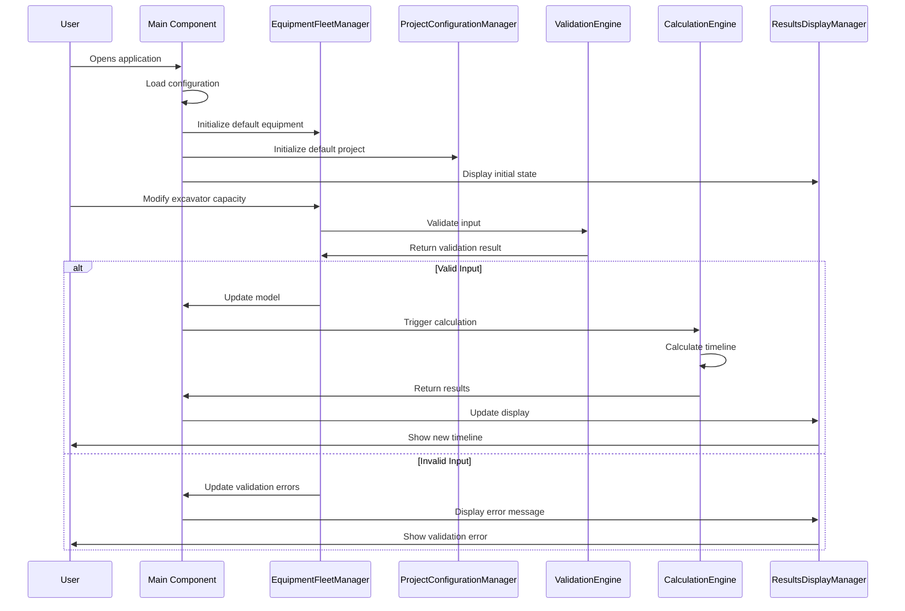
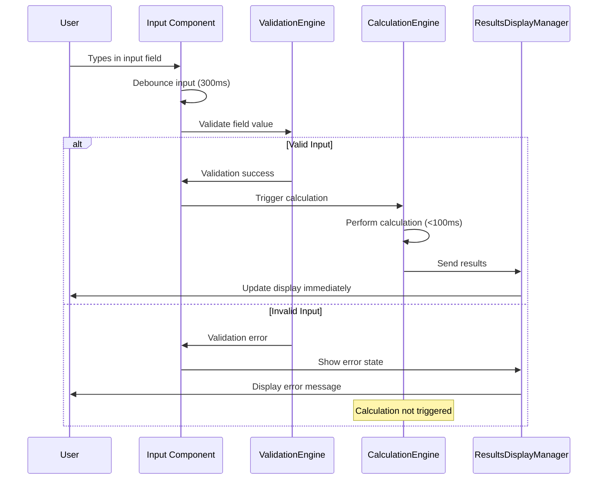

# Core Workflows

## User Calculation Workflow

```mermaid
sequenceDiagram
    participant U as User
    participant M as Main Component
    participant F as EquipmentFleetManager
    participant P as ProjectConfigurationManager
    participant V as ValidationEngine
    participant C as CalculationEngine
    participant R as ResultsDisplayManager

    U->>M: Opens application
    M->>M: Load configuration
    M->>F: Initialize default equipment
    M->>P: Initialize default project
    M->>R: Display initial state
    
    U->>F: Modify excavator capacity
    F->>V: Validate input
    V->>F: Return validation result
    alt Valid Input
        F->>M: Update model
        M->>C: Trigger calculation
        C->>C: Calculate timeline
        C->>M: Return results
        M->>R: Update display
        R->>U: Show new timeline
    else Invalid Input
        F->>M: Update validation errors
        M->>R: Display error message
        R->>U: Show validation error
    end
```

## Real-time Calculation Update Workflow

```mermaid
sequenceDiagram
    participant U as User
    participant I as Input Component
    participant V as ValidationEngine
    participant C as CalculationEngine
    participant R as ResultsDisplayManager

    U->>I: Types in input field
    I->>I: Debounce input (300ms)
    I->>V: Validate field value
    
    alt Valid Input
        V->>I: Validation success
        I->>C: Trigger calculation
        C->>C: Perform calculation (<100ms)
        C->>R: Send results
        R->>U: Update display immediately
    else Invalid Input
        V->>I: Validation error
        I->>R: Show error state
        R->>U: Display error message
        Note over C: Calculation not triggered
    end
```
