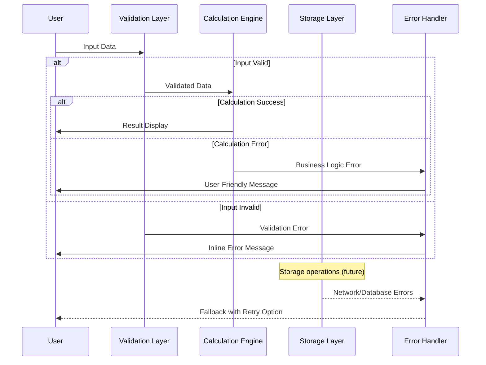

# Error Handling Strategy

## Error Flow



## Error Response Format

**Elm Error Types:**
```elm
-- Unified error type covering all error categories
type AppError
    = ValidationErr ValidationError
    | CalculationErr CalculationError  
    | ConfigurationErr ConfigurationError
    | NetworkErr NetworkError
    | StorageErr StorageError

-- Validation errors with specific field context
type ValidationError
    = ValueTooLow { field : FieldId, actual : Float, minimum : Float }
    | ValueTooHigh { field : FieldId, actual : Float, maximum : Float }
    | RequiredField FieldId
    | InvalidFormat { field : FieldId, expected : String, actual : String }
    | BusinessRuleViolation { field : FieldId, rule : String, explanation : String }

-- Calculation errors for business logic failures
type CalculationError
    = EquipmentConfigurationError String
    | InsufficientData { missing : List String }
    | NumericalOverflow { operation : String, values : List Float }
    | BusinessConstraintViolation { constraint : String, explanation : String }
    | PerformanceTimeout { operationMs : Int, limitMs : Int }
```

## Frontend Error Handling

**Error Display Components:**
```elm
{-| Display validation errors inline with form fields.
    Shows specific error message with recovery guidance.
-}
viewValidationError : FieldId -> ValidationError -> Html msg
viewValidationError fieldId error =
    case error of
        ValueTooLow { actual, minimum } ->
            div [ class Theme.errorMessage ]
                [ Icon.warning
                , text ("Value " ++ formatFloat actual ++ " is below minimum " ++ formatFloat minimum)
                , viewErrorHelp fieldId "Try increasing the value or check equipment specifications"
                ]
        
        BusinessRuleViolation { rule, explanation } ->
            div [ class Theme.errorMessage ]
                [ Icon.info
                , text explanation
                , viewErrorHelp fieldId ("Business rule: " ++ rule)
                ]
```

**Error Recovery Patterns:**
```elm
{-| Graceful degradation when configuration loading fails.
    Falls back to hardcoded defaults to keep app functional.
-}
handleConfigurationError : ConfigurationError -> ( Model, Cmd Msg )
handleConfigurationError error =
    let
        defaultConfig = createHardcodedDefaults()
        
        warningMessage = 
            case error of
                ConfigFileNotFound file ->
                    "Could not load " ++ file ++ ". Using default settings."
                _ ->
                    "Configuration error. Using default settings."
    in
    ( { model 
        | appConfig = defaultConfig
        , systemWarnings = warningMessage :: model.systemWarnings
      }
    , Cmd.none
    )
```
