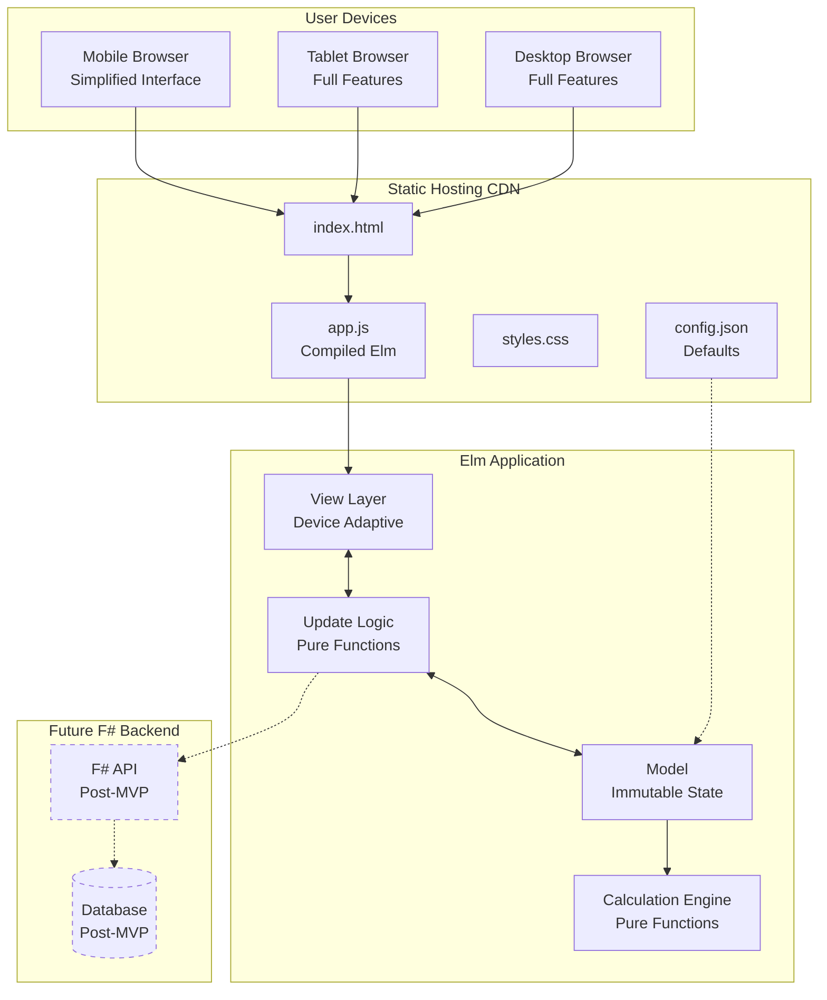

# High Level Architecture

## Technical Summary
The Pond Digging Calculator is a **pure client-side web application** built with **Elm 0.19+** that provides instant pond excavation timeline calculations through a functional programming architecture. The application deploys as static files to **GitHub Pages or Netlify**, eliminating server infrastructure costs while delivering sub-second calculation updates. The system features a responsive design that adapts complexity by device - comprehensive mixed-fleet capabilities on desktop/tablet interfaces and simplified calculator functionality on mobile. All calculations execute through pure functions with immutable data structures, ensuring zero runtime exceptions critical for professional construction tool credibility. This architecture achieves the PRD goals of instant calculations, professional reliability, and accessibility across all device types while maintaining a clear migration path to add an F# backend for future data persistence needs.

## Platform and Infrastructure Choice

**Platform:** Static Hosting (GitHub Pages or Netlify)
**Key Services:** 
- GitHub Pages for hosting (free tier)
- JSON configuration files for defaults
- Client-side Elm application
- No backend services in MVP
**Deployment Host and Regions:** 
- Primary: GitHub Pages (global CDN)
- Alternative: Netlify (global edge network)
- Region: Global distribution via CDN

## Repository Structure

**Structure:** Monorepo
**Monorepo Tool:** N/A - Simple structure, npm/yarn workspaces if needed
**Package Organization:** 
- Single Elm application package
- Shared configuration in JSON files
- Build scripts in root directory
- Future: packages/ folder when F# backend added

## High Level Architecture Diagram

## Architectural Patterns

- **Elm Architecture (TEA):** Model-View-Update pattern with unidirectional data flow for predictable state management - _Rationale:_ Ensures type safety and eliminates runtime exceptions critical for professional tools
- **Functional Core, Imperative Shell:** Pure calculation functions wrapped by minimal imperative UI layer - _Rationale:_ Maximizes testability and reliability of core business logic
- **Static Site Generation:** Pre-built assets served from CDN without server computation - _Rationale:_ Zero infrastructure costs and global availability with excellent performance
- **Progressive Enhancement:** Core functionality works immediately, advanced features load as needed - _Rationale:_ Ensures fast initial load and immediate utility for users
- **Device-Adaptive Complexity:** Different feature sets for mobile vs desktop/tablet - _Rationale:_ Optimizes user experience for different work contexts (field vs office)
- **Configuration as Code:** JSON configuration files for defaults and validation rules - _Rationale:_ Enables post-deployment updates without recompilation
- **Immutable Data Structures:** All state changes create new objects rather than mutations - _Rationale:_ Prevents bugs from shared mutable state and enables time-travel debugging
